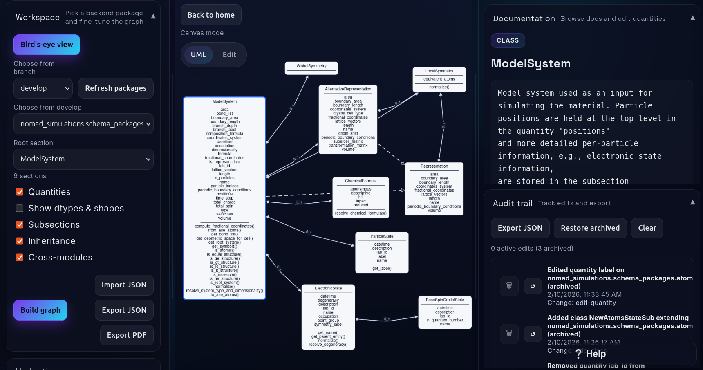

# Schema Studio

Interactive schema explorer and editor for data models.

`schema-studio` (the package entrypoint) launches **Light Mode** by default:
- Local single-user app (no auth)
- No MongoDB/Redis required
- Custom edits persisted in local SQLite
- Schema source pinned to `nomad-simulations` `develop`

Back end: **FastAPI**  
Front end: **React + Cytoscape + ELK**  
Python: **3.11+**



## Quick Start (Current: from source)

> PyPI release is not live yet.

### 1) Install

Clone and enter in the project folder:

```bash
git clone https://github.com/EBB2675/schema-studio.git
cd schema-studio
```

Create a virtual environment (either with `venv` or with `conda`) and activate it:
```bash
python -m venv .venv
source .venv/bin/activate  # In Linux-based OS
```

Install the dependencies of the project:
```bash
pip install -e .
```

**Note**: we recommend using [`uv`](https://docs.astral.sh/uv/) for a faster installation of the dependencies:
```bash
uv sync
```

### 2) Run
```bash
schema-studio
```

This starts the local server on `http://127.0.0.1:5179` and opens your browser automatically.

### 3) First-use flow
1. Pick a package.
2. Pick a root section (or leave empty for all sections).
3. Click **Build graph**.
4. Click classes/quantities to view docs and metadata.
5. Toggle **Editable mode** to add classes/quantities.

## What You Get in Light Mode

- UML-style class cards (sections) with quantities and relationships
- Class + quantity documentation panel
- Under-the-hood usage panel (normalizers/helpers)
- Bird's-eye package/class overview
- Editable graph (add classes, add/rename/remove quantities)
- JSON export and PDF snapshot export
- Optional **Send Design** action when `SCHEMA_STUDIO_SEND_ENDPOINT` is configured

## Light Mode vs Dev Mode

| Capability | Light Mode (current) | Dev Mode (source/full stack) |
|---|---|---|
| Install path | `pip install -e .` | Clone repo + Docker/local services |
| Auth | No | Yes |
| Multi-user | No | Yes |
| Branch switching/diff | No | Yes |
| Persistence | Local SQLite | MongoDB |
| Background jobs | Not required | Celery + Redis |

## Optional Configuration

Make sure to set the environment variables before running `schema-studio`.

| Variable | Default | Purpose |
|---|---|---|
| `SCHEMA_STUDIO_HOST` | `127.0.0.1` | Bind host |
| `SCHEMA_STUDIO_PORT` | `5179` | Bind port |
| `SCHEMA_STUDIO_HOME` | platform config dir | Where Light Mode stores SQLite data |
| `SCHEMA_STUDIO_DEFAULT_PACKAGE` | `nomad_simulations.schema_packages.model_method` | Initial package |
| `SCHEMA_STUDIO_DEFAULT_NAMESPACE` | `nomad_simulations.schema_packages` | Initial base namespace |
| `SCHEMA_STUDIO_AUTO_BOOTSTRAP_SCHEMA` | `1` | Auto-bootstrap schema when missing |
| `SCHEMA_STUDIO_SEND_ENDPOINT` | unset | Enable `POST /send-design` passthrough |
| `SCHEMA_STUDIO_DIST_DIR` | auto-detected | Override frontend static assets directory |
| `UVICORN_LOG_LEVEL` | `info` | Server logging level |

### Data location
Light Mode stores data in:
- `$SCHEMA_STUDIO_HOME/light_mode.sqlite3` (if `SCHEMA_STUDIO_HOME` is set), or
- your platform config directory (fallback: `./.schema_studio_light/light_mode.sqlite3`).

## Keeping Schema Fresh

Light Mode can update its pinned schema source:
- In the UI: click **Update schema**
- API: `POST http://127.0.0.1:5179/schema/update`

Version info endpoint:
- `GET http://127.0.0.1:5179/schema/version`

## Common Issues

### `405 Method Not Allowed` when building graph
You are likely using a Dev Mode frontend build with a Light Mode backend.

Fix:
```bash
VITE_LIGHT_MODE=true npm --prefix web run build
```
Then restart `schema-studio`.

### `GET /git/branches` returns `410`
Expected in Light Mode. Branch switching is intentionally disabled.

### Branch/package lists are empty
Run schema update once:
```bash
curl -X POST http://127.0.0.1:5179/schema/update
```

### `ImportError: cannot import name 'model_validator'`
You are likely on an older Pydantic install. Use a clean Python 3.11+ environment and reinstall.

## Dev Mode (Full Stack) Quick Start

Use this if you need auth, multi-user, branch diff, Mongo, and Celery.

```bash
git clone https://github.com/EBB2675/schema-studio.git
cd schema-studio
cp .env.example .env
# set SCHEMA_UML_REPO_HOST, SCHEMA_UML_SECRET, SCHEMA_UML_PW_SALT
docker compose up --build -d
```

Open `https://localhost`.

## Local Source Development Notes

- Backend deps: `api/requirements.txt`
- Source installs use bundled Light Mode static assets by default, so end users do not need a frontend build.
- If you change frontend code and want to ship those updates in Light Mode, refresh bundled static assets:
  ```bash
  VITE_LIGHT_MODE=true npm --prefix web run build
  ./scripts/sync_light_mode_static.sh
  ```
- Then install/run:
  ```bash
  pip install -e .
  schema-studio
  ```

## Desktop Development (Tauri Work-In-Progress)

The desktop rollout is being developed incrementally on top of `tauri-changes-test`.

Current direction:
- Tauri manages a native window.
- Tauri starts the Light Mode backend as a child process.
- The backend must not open a browser when launched by Tauri.
- Closing the desktop app should terminate the backend process tree.

Current limitations observed in this environment:
- `node` is not available on `PATH`
- `cargo` is not available on `PATH`
- `python -m venv .venv` hit an `ensurepip` permission issue here

Planned dev smoke test once prerequisites are installed:
```bash
cd web
npm install
npm run tauri:dev
```

You can optionally create a repo-root `.env` using `.env.light.example`.
The Tauri launcher reads `.env` from the repository root before it starts the backend.

Useful desktop-specific variables:
- `SCHEMA_STUDIO_DESKTOP_MODE` — currently `light` only
- `SCHEMA_STUDIO_DESKTOP_PYTHON` — explicit Python interpreter path
- `SCHEMA_STUDIO_DESKTOP_BACKEND` — explicit path to a packaged backend executable
- `SCHEMA_STUDIO_DESKTOP_PORT` — backend port for the desktop launcher
- `SCHEMA_STUDIO_DESKTOP_REUSE_BACKEND` — set to `1` to attach to an already-running backend during development

See `docs/tauri-light-mode-plan.md` for the branch-by-branch rollout and packaging strategy.

## Windows Packaging (First Desktop Target)

The current packaging path targets Windows first:

1. Build the frontend for Light Mode:
   ```bash
   cd web
   VITE_LIGHT_MODE=true npm run build
   ```
2. Build the Python backend sidecar from the repo root:
   ```bash
   python scripts/build_light_mode_backend.py
   ```
3. Build the Tauri installer:
   ```bash
   cd web
   npm run tauri:build
   ```

Notes:
- The sidecar build currently uses `PyInstaller`.
- The generated binary is placed under `web/src-tauri/binaries/`.
- The Tauri launcher will prefer the packaged backend binary when it exists and fall back to Python only for development.

## API (Light Mode)

Core endpoints:
- `GET /health`
- `GET /workspace`, `PUT /workspace`
- `GET /roots`, `GET /schema`, `GET /overview`, `GET /usage`
- `POST /schema/custom-class`, `POST /schema/custom-quantity`
- `DELETE /schema/custom-edits`, `DELETE /schema/custom-edit`
- `GET /schema/version`, `POST /schema/update`, `POST /send-design`
- `GET /git/packages` (fixed branch behavior)

## Authors

**[Dr. Esma B. Boydas](https://github.com/EBB2675)**  
Humboldt-Universität zu Berlin / FAIRmat-NFDI

**[Dr. Jose M. Pizarro](https://github.com/JosePizarro3)**  
Bundesanstalt fur Materialforschung und -prüfung (BAM)  
Original idea and technical guidance.


## License

SchemaStudio is licensed under the MIT License. Third-party dependencies are subject to their own respective licenses.
