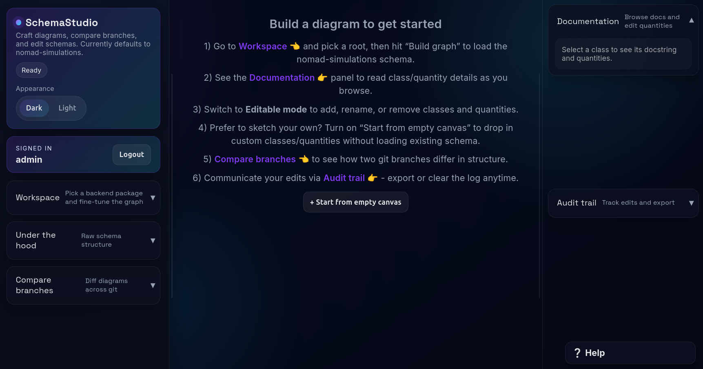
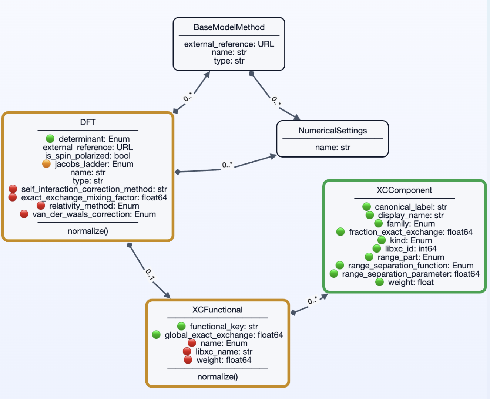

# Schema Studio

Interactive editor for data models.

Supports two runtime modes:
- **Light Mode**: pip-installable, local single-user mode with SQLite persistence and no external services.
- **Dev Mode**: full multi-user/auth/git-branch mode with Mongo + optional Redis/Celery.

Back end: **FastAPI** · Front end: **React + Cytoscape + ELK**.
Deployment: **Docker Compose + Caddy** (optional).
Python: **3.11 recommended/tested** (package requires **>=3.11**).

- Visualizes **sections** as UML cards (attributes = quantities, edges = subsections).
- Right-hand **Doc Panel** shows the **class docstring** and a **clickable list of quantities**.
- Right-hand **Under the hood** panel shows **normalization and helper functions** that act on the selected section (based on the repo you configure).
- **Branch diff** (base → head) highlights **added/changed/removed** nodes/edges, including quantity changes (**Dev Mode only**).
- **Bird's-eye overview**: inspect packages/classes across branches without building a full graph.
- **Editable mode**: add classes and quantities directly in the UI (server validates supported dtypes; new classes get fully-qualified ids and accept quantities immediately).
- **Empty canvas**: start from a blank namespace (`<base>.custom_schema`), edit freely, and reset persisted edits with one click.
- **Export**: download the current graph as JSON or a PDF snapshot.

---

# Overview






---

## ✨ Features

- **UML cards**: Section name, attributes (quantity name, dtype, shape, cardinality), and optional methods.
- **Doc panel**: Click a class to see its docstring; click a quantity in the panel to see its docstring.
- **Under-the-hood panel**:
  - Click a class to see which **normalize methods** and **module-level helpers** the viewer can associate with that section.
  - Information is derived from schema modules and backend indexing logic.
- **Branch comparison** (**Dev Mode only**): Choose two Git branches and render the diff with visual highlights.
- **Namespace filtering**: Limit traversal to a base namespace; optionally include cross-module links.
- **Bird's-eye overview**: Switch to Overview mode to list packages/classes.
- **Editable quantities/classes**: Toggle Editable mode to add classes (as inheritance or subsection relationships) and add, rename, or remove quantities from the selected class card (full editor, not just a viewer).
- **Optional overlays**: Inheritance edges and dtype/shape metadata are toggles (inheritance now on by default so new class relationships are visible).
- **Export**: Save the current graph as JSON or a PDF (PNG-backed) snapshot.
- **Async extraction**: Graph builds and branch diffs run through Celery background jobs (Redis by default) so the API stays responsive under load. The UI polls task endpoints automatically; disable with `VITE_USE_TASK_API=false` if you prefer synchronous calls.

---

## 🚀 Quick Start (pick one)

### Option A — Light Mode (PyPI, no Mongo/Redis)
```bash
python -m venv .venv
source .venv/bin/activate
pip install schema-studio
schema-studio
```
This starts a local Light Mode server and opens the browser.

Light Mode defaults:
- Single-user local app (no login required)
- No branch switching/diff UI
- Schema source pinned by policy to `nomad-simulations` `develop` lineage
- Custom edits persisted in local SQLite
- Use **Update schema** (or `POST /schema/update`) to pull latest `develop` after install

### Option B — Docker Compose (Dev Mode, easiest full stack)
```bash
git clone https://github.com/EBB2675/schema-studio.git
cd schema-studio
cp .env.example .env
# set SCHEMA_UML_REPO_HOST to your local schema repo path, and set SCHEMA_UML_SECRET / SCHEMA_UML_PW_SALT
docker compose up --build -d
```
Then open https://localhost (Caddy handles API + frontend). Redis, Celery worker, Mongo, API, and frontend all start in this one command.
Default ports (Docker Compose): frontend 5173, API 5179, Redis 6379, Mongo 27017, Caddy 80/443.

### Option C — Local dev (`dev.sh`) with one extra Redis + worker
1) Create env: `conda create -n schema-studio python=3.11 -y && conda activate schema-studio`
2) Install deps: `pip install -r api/requirements.txt`
3) Run Redis (Docker is fine): `docker run --name schema-uml-redis -p 6379:6379 redis:7-alpine`
4) Start Celery worker (new terminal):
   ```bash
   conda activate schema-studio
   export CELERY_BROKER_URL=redis://localhost:6379/0
   export CELERY_RESULT_BACKEND=redis://localhost:6379/1
   celery -A api.celery_app.celery_app worker --loglevel=info
   ```
5) Start API + frontend (original terminal):
   ```bash
   export SCHEMA_UML_REPO=/path/to/your/schema-repo
   ./dev.sh
   ```
6) Log in at http://localhost:5173 with `admin` / `admin` (change via env).

Notes:
- Mongo: install locally or let `START_MONGO_DOCKER=1 ./dev.sh` spin up a container.
- If Redis is missing, Celery falls back to eager mode (tasks run inline); background jobs are better.
- For source-based Light Mode development, build the Light Mode frontend before launching:
  - `VITE_LIGHT_MODE=true npm --prefix web run build`
  - then run `schema-studio` (or set `SCHEMA_STUDIO_DIST_DIR` explicitly).

---

## 🧱 Deployment (Docker Compose)

Production-leaning single-host setup with HTTPS via Caddy, a FastAPI API container,
MongoDB, and a read-only mount of the datamodel repo.

### Architecture 
```
Internet
  |
Caddy (:80/:443)
  |-- / (static frontend)
  |-- /api -> FastAPI
  |
Docker network
  |-- api (FastAPI + extractor)
  |-- celery-worker (background jobs)
  |-- redis (broker/result backend)
  |-- mongo (persistent)
  |-- schema repo (host mount, read-only)
  |-- schema-data (named volume for repo cache/worktrees)
```

### 1) Create `.env`
```bash
cp .env.example .env
```
Fill in:
- `SCHEMA_UML_REPO_HOST=/absolute/path/to/your/schema-repo`
- `SCHEMA_UML_SECRET=...` (long random string)
- `SCHEMA_UML_PW_SALT=...` (long random string)
- `CADDY_DOMAIN=localhost` for local use (Caddy will likely enable HTTPS with a local cert); use your real domain for public HTTPS
- `VITE_API_BASE=/api`
- `SCHEMA_UML_EXTRACTOR_TIMEOUT_SECONDS=120` (optional)
- Celery / Redis: `CELERY_BROKER_URL`, `CELERY_RESULT_BACKEND`, `CELERY_WORKER_CONCURRENCY`, `CELERY_TASK_SOFT_TIME_LIMIT`, `CELERY_TASK_TIME_LIMIT`

### 2) Build and run
```bash
docker compose up --build -d
```

### 3) Open the app
- `https://localhost` (or `https://your-domain` if you set a real domain)

### Notes
- The API image bakes in schema dependencies (`nomad-lab[infrastructure]`, `matid`)
  so startup is fast and repeatable.
- Set `SCHEMA_UML_INSTALL_SCHEMA_DEPS=false` (default) to avoid runtime installs.
- The backend stores git mirrors/worktrees under `/schema-data` (named volume).
- Docker Compose starts Redis + a Celery worker; graph builds and diffs run asynchronously. If you swap brokers, update `CELERY_BROKER_URL` / `CELERY_RESULT_BACKEND` and adjust worker concurrency. For local dev without Redis, you can set `CELERY_TASK_ALWAYS_EAGER=true` to execute tasks inline (not recommended for production).
- Redis in `docker-compose.yml` runs with persistence disabled (`--save "" --appendonly no`) to keep the dev stack ephemeral; for production deployments that need durable task history, drop that command or enable AOF/RDB persistence.

## 🧠 How to Use

1. **Package**: Choose a package from the dropdown (populated per branch/base namespace).
2. **Root section**: Auto-populated from the package; pick one (e.g. `ModelMethod`) or leave empty to load all.
3. **Build graph**: Render UML cards and composition edges.
4. **Doc panel**: Click a class → see its docstring + list of quantities; click a quantity to view its docstring.
5. **Under the hood panel**: Click a class → see which normalizers and module-level helpers are associated with that section.
6. **Editable mode** (Doc panel): Toggle **Editable mode**, then add classes or add/rename/remove quantities on the selected class (supported dtypes are validated server-side; new classes can immediately receive quantities).
7. **Compare branches** (**Dev Mode only**): Choose **Base** and **Head** → **Compare** to see a visual diff.
8. **Export**: Download the current graph as **JSON** or a **PDF** snapshot from the sidebar.

Legend:
- 🟩 **Added** (green border / edges)
- 🟨 **Changed** (amber border)
- 🟥 **Removed** (shown in diff banner; removed edges dashed red)

---

## ⚙️ Backend Endpoints (summary)

- **Dev Mode API** (`api/main.py` + routers):
  - Auth/workspace/health: `POST /auth/login`, `POST /auth/register`, `GET /workspace`, `PUT /workspace`, `GET /health`, `GET /`
  - `GET /roots`, `GET /schema`
  - `POST /graph`, `POST /graph/diff`
  - `POST /tasks/graph`, `POST /tasks/graph/diff`, `GET /tasks/{task_id}`
  - `GET /git/branches`, `GET /git/packages`
  - `POST /schema/custom-class`, `POST /schema/custom-quantity`, `DELETE /schema/custom-edits`
  - `GET /overview`, `GET /usage`
- **Light Mode API** (`api/light_mode/app.py`):
  - `GET /health`, `GET /workspace`, `PUT /workspace`
  - `GET /roots`, `GET /schema`, `GET /overview`, `GET /usage`
  - `POST /schema/custom-class`, `POST /schema/custom-quantity`, `DELETE /schema/custom-edits`
  - `GET /schema/version`, `POST /schema/update`, `POST /send-design`
  - `GET /git/packages` (fixed `develop` behavior), `GET /git/branches` returns `410` (disabled by policy)

- Shared query flags: see **Shared query flags** below (used by `/schema`, `/graph`, `/graph/diff`, `/tasks/graph`, `/tasks/graph/diff` where applicable).

### Shared query flags
- `include_quantities` — include quantity metadata in nodes.
- `include_subsections` — include composition edges / child sections.
- `include_inheritance` — include inheritance edges.
- `allow_cross_module` — allow traversal across modules within the base namespace.
- `base_namespace` — dotted package root to scope traversal.
- `root` — limit the graph to a specific section root (class name).
- `empty` — return an empty shell graph (used for empty-canvas + custom edits replay).

> Quantity docstrings are embedded directly in `/schema`.
> The builder that does this is `extractor/graph_builder.py`.

---

## Glossary
- **Base namespace**: dotted package root that scopes traversal (e.g., `nomad_simulations.schema_packages`).
- **Package**: concrete Python module under the base namespace that you build graphs from (e.g., `nomad_simulations.schema_packages.model_method`).
- **Root section**: class name to start traversal from; empty means include all sections in the package.
- **Empty canvas**: graph shell with no nodes/edges; UI replays custom edits on top (use `empty=true`).
- **Custom edits**: user-added classes/quantities persisted per user/branch/package via the custom edit endpoints.

---

## 🧩 Implementation Notes

- **Graph builder** (`extractor/graph_builder.py`)
  - Serializes sections and quantities with robust doc extraction (`description`, `m_def.description`, `__doc__`).
  - Quantities are **not rendered as separate boxes** in the canvas. They are folded into the class card and listed in the Doc Panel.
- **Frontend**
  - `web/src/GraphView.tsx`: builds Cytoscape graph (sections + composition edges), wires selection to the store, supports diff overlays and export hook.
  - `web/src/components/DocPanel.tsx`: shows class/quantity docs; lists quantities with dtype/shape/card; inline actions for editable mode.
  - `web/src/components/UnderTheHoodPanel.tsx`: for the selected class, calls `/usage` on API base and renders the normalization list.
  - `web/src/components/AddQuantityForm.tsx` and `web/src/components/QuantityEditPanel.tsx`: UI for adding/renaming/removing quantities.
- **Legacy**: An archived SQLite→Mongo migration helper lives at `scripts/legacy/migrate_sqlite_to_mongo.py` for historical one-off data lifts; do not run it alongside the app.
  - `web/src/store/selection.ts`: Zustand store for selected node.
- **ELK Layout**: layered, right-directed; label size is included in node dimensions.

---

## 🔧 Troubleshooting

- **Light Mode shows `405 Method Not Allowed` when building graph**
  - You are likely serving a Dev Mode frontend build against the Light Mode backend.
  - Rebuild UI with `VITE_LIGHT_MODE=true npm --prefix web run build`.
  - Restart `schema-studio` and hard-refresh the browser.
- **Branches list is empty**
  - Dev Mode only.
  - Ensure `NOMAD_SIM_REPO` (or `GIT_REPO_DIR`) points to a valid Git repo.
  - Check `curl http://127.0.0.1:5179/git/branches`.
- **`GET /git/branches` returns `410` in Light Mode**
  - Expected behavior. Branch switching is disabled by Light Mode policy.
- **Quantities show “No docstring available.”**
  - Ensure `extractor/graph_builder.py` includes `doc=_doc_from(q)` for quantities.
  - Restart backend and reload frontend.
- **Vite overlay / missing deps**
  - Install: `npm i zustand cytoscape cytoscape-elk elkjs` (and `react-markdown` if you render markdown docs).
  - Clear cache: `rm -rf web/node_modules web/node_modules/.vite && npm i`.
- **Pydantic import error (`model_validator`)**
  - The backend relies on **Pydantic v2** (`pydantic>=2,<3`).
  - If you see `ImportError: cannot import name 'model_validator'`, an older global install may be shadowing your environment; reinstall requirements inside a clean virtualenv/conda env to pick up v2.

---

## 📁 Auto-generated Data

The backend may create working data under:
```
api/_data/
```
These are temporary and should **not** be committed.

---

## 👩‍💻 Author

**Dr. Esma Birsen Boydaş**
NOMAD Laboratory (FAIRmat), Humboldt-Universität zu Berlin

> Work in progress — scope and UI may evolve.
