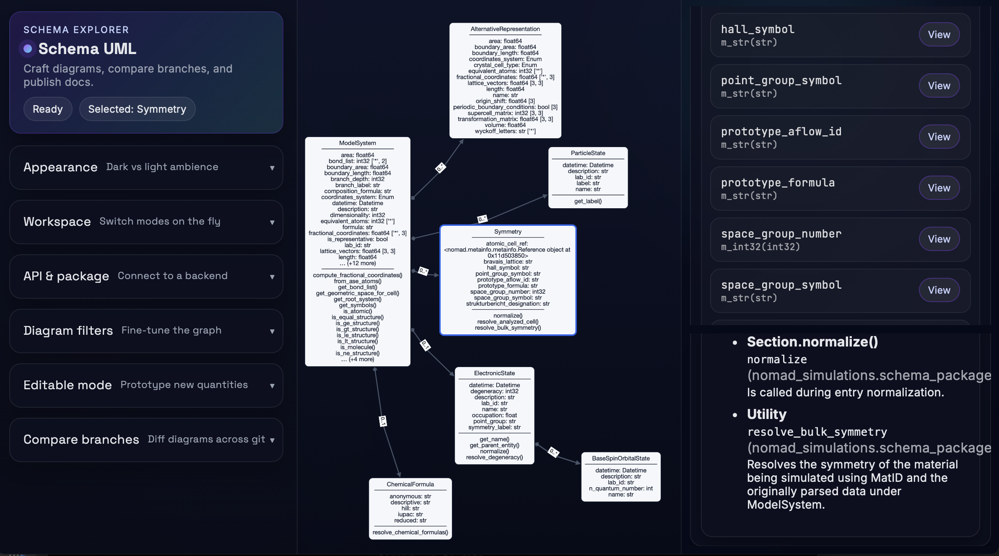

# Schema UML Viewer

Interactive UML-style viewer for NOMAD-compatible schemas (defaults to `nomad-simulations`).


Back end: **FastAPI** · Front end: **React + Cytoscape + ELK**.

- Visualizes **sections** as UML cards (attributes = quantities, edges = subsections).
- Right-hand **Doc Panel** shows the **class docstring** and a **clickable list of quantities**.
- Right-hand **Under the hood** panel shows **normalization and helper functions** that act on the selected section.
- **Branch diff** (base → head) highlights **added/changed/removed** nodes/edges.

---

# Overview



---

## ✨ Features

- **UML cards**: Section name, attributes (quantity name, dtype, shape, cardinality), and optional methods.
- **Doc panel**: Click a class to see its docstring; click a quantity in the panel to see its docstring.
- **Under-the-hood panel**:
  - Click a class to see which **normalize methods** and **module-level helpers** the viewer can associate with that section.
  - Information is derived from `nomad-simulations` via a small introspection/indexing step in the backend.
- **Branch comparison**: Choose two Git branches and render the diff with visual highlights.
- **Namespace filtering**: Limit traversal to a base namespace; optionally include cross-module links.
- **RDFS I/O**: Import RDFS schema files into the editor and export edited diagrams back to RDFS.

---

## 🚀 Quick Start

### 1) Clone
```bash
git clone https://github.com/EBB2675/schema-uml.git
cd schema-uml
```

### 2) Environment (Python 3.11)
```bash
conda create -n schema-uml python=3.11 -y
conda activate schema-uml
pip install -r requirements.txt
```

### 3) Point to your schema repo
The backend reads from a local clone. Set one of (required before starting the stack):
```bash
# preferred (general)
export SCHEMA_UML_REPO=<path-or-URL-to-your-schema-repo>
# optional: explicitly point to nomad-measurements when using both namespaces
# export NOMAD_MEASURE_REPO=/path/to/nomad-measurements
# backwards-compatible options also accepted by backend
# export NOMAD_SIM_REPO=/path/to/nomad-simulations
# export GIT_REPO_DIR=/path/to/nomad-simulations
# optional: override the default base package used in UI helpers
# export SCHEMA_UML_BASE_PACKAGE=my_schema_root
# optional: override the default package used in UI helpers
# export SCHEMA_UML_PACKAGE=my_schema_root.module
```
Make it persistent by adding the export to `~/.bashrc` or `~/.zshrc`.

### 4) Run everything with one command
```bash
./dev.sh
```

What it does:

- Starts the FastAPI backend on **5179**.
- Verifies **SCHEMA_UML_REPO / NOMAD_SIM_REPO / GIT_REPO_DIR** points to a **local git repo** (a subdirectory of a clone is fine; fails fast otherwise).
- Ensures `web/node_modules` exists (runs `npm install` on first launch).
- Starts the Vite frontend on **5173**.
- Stops both together on **Ctrl+C** (no manual job control needed).
- Exits early with a helpful message if `uvicorn` or `npm` are missing (activate your virtualenv first).

Stop both with **Ctrl+C**. Override ports via `API_PORT` / `WEB_PORT` env vars.

Sanity checks (optional, while `./dev.sh` is running):
```bash
curl 'http://127.0.0.1:5179/roots?package=nomad_simulations.schema_packages.model_method'
curl 'http://127.0.0.1:5179/schema?package=nomad_simulations.schema_packages.model_method&root=ModelMethod&include_quantities=true'
curl 'http://127.0.0.1:5179/git/branches'
```

---

## 🧠 How to Use

1. **Package**: Enter a Python package (e.g. `nomad_simulations.schema_packages.model_method`).
2. **Load roots**: Fetch available section classes from the package.
3. **Root section**: Pick one (e.g. `ModelMethod`) or leave empty to load all.
4. **Build graph**: Render UML cards and composition edges.
5. **Doc panel**: Click a class → see its docstring + list of quantities; click a quantity to view its docstring.
6. **Under the hood panel**: Click a class → see which normalizers and module-level helpers are associated with that section.
7. **Compare branches**: Choose **Base** and **Head** → **Compare** to see a visual diff.

Legend:
- 🟩 **Added** (green border / edges)  
- 🟨 **Changed** (amber border)  
- 🟥 **Removed** (shown in diff banner; removed edges dashed red)

---

## ⚙️ Backend Endpoints (summary)

- `GET /roots?package=...` → `{"sections": [...]}`  
- `GET /schema`  
  Params: `package, root?, include_quantities?, include_subsections?, allow_cross_module?, base_namespace?`  
  Returns: `{ package, root, nodes, edges }` where:
  - `nodes[*].kind ∈ {"section","quantity"}`
  - `nodes[*].doc` is populated for **both sections and quantities**
- `GET /git/branches` → `{"branches":[...], "active": "...", "head": "SHA"}`  
- `POST /graph/diff` → `{ base:{branch,sha,graph}, head:{...}, diff:{nodes:{added,removed,changed}, edges:{added,removed}} }`

> Quantity docstrings are embedded directly in `/schema`.  
> The builder that does this is `extractor/graph_builder.py`.

---

## 🧩 Implementation Notes

- **Graph builder** (`extractor/graph_builder.py`)
  - Serializes sections and quantities with robust doc extraction (`description`, `m_def.description`, `__doc__`).
  - Quantities are **not rendered as separate boxes** in the canvas. They are folded into the class card and listed in the Doc Panel.
- **Frontend**
  - `web/src/GraphView.tsx`: builds Cytoscape graph (sections + composition edges), wires selection to the store.
  - `web/src/components/DocPanel.tsx`: shows class/quantity docs; lists quantities with dtype/shape/card.
  - `web/src/components/UnderTheHoodPanel.tsx`: for the selected class, calls /usage on API base and renders the normalization list.
  - `web/src/store/selection.ts`: Zustand store for selected node.
- **ELK Layout**: layered, right-directed; label size is included in node dimensions.

---

## 🔧 Troubleshooting

- **Branches list is empty**
  - Ensure `NOMAD_SIM_REPO` (or `GIT_REPO_DIR`) points to a valid Git repo.
  - Check `curl http://127.0.0.1:5179/git/branches`.
- **Quantities show “No docstring available.”**
  - Ensure `extractor/graph_builder.py` includes `doc=_doc_from(q)` for quantities.
  - Restart backend and reload frontend.
- **Vite overlay / missing deps**
  - Install: `npm i zustand cytoscape cytoscape-elk elkjs` (and `react-markdown` if you render markdown docs).
  - Clear cache: `rm -rf web/node_modules web/node_modules/.vite && npm i`.

---

## 📁 Auto-generated Data

The backend may create working data under:
```
api/_data/
```
These are temporary and should **not** be committed.

---

## 🧪 Example

Package: `nomad_simulations.schema_packages.model_method`  
Root: `ModelMethod`  
- Toggle **Quantities** and **Subsections** as needed.  
- Compare `develop` → `sprint-dft-qchem` to see DFT/solvation updates reflected in UML and doc panel.

---

## 👩‍💻 Author

**Dr. Esma Birsen Boydaş**  
NOMAD Laboratory (FAIRmat), Humboldt-Universität zu Berlin

> Work in progress — scope and UI may evolve.